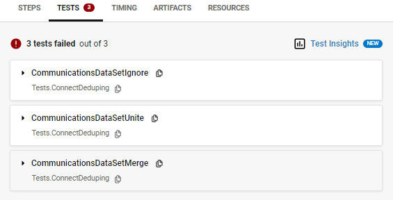

# CircleCI Recommendation

## Summary

```yml
- run:
   command: |
     dotnet test ... --logger:"junit;LogFilePath=TestResults/test-result.xml;FailureBodyFormat=Verbose"
- store_test_results:
   path: TestResults/
```

## Details

CircleCI uses just a few pieces of the JUnit XML report to generate the displayed user interface.

For each failed test (i.e. for each JUnit `<testcase>` element containing a failure or an error),
CircleCI only shows the testcase's failure/error message, any text within the failure/error element, plus any `<system-out>` or `<system-err>` text.
It does not show the testcase's properties.
It does not show data from the testsuite.

By default, the logger records test console output in the JUnit testsuite,
which CircleCI ignores;
this can be improved upon by setting FailureBodyFormat when invoking the logger.
Setting MethodFormat provides no additional information or functionality.

### FailureBodyFormat

Setting `FailureBodyFormat=Verbose` when invoking the logger ensures that any test console output is visible in the CircleCI UI for (failed) tests.
This can provide important/useful information,
especially if the test failure message is insufficiently informative on its own.

- `Default`:

  

- `Verbose`:

  

### MethodFormat

CircleCI shows the class names of each failed test so setting `MethodFormat=Class` or `MethodFormat=Full` provides no further information on the CircleCI UI; the effect is purely cosmetic and is a matter of personal preference.

- `Default`:

  

- `Class` and `Full`:

  

-----

## Footnote

As of July 20 2023:

- Only the data in a `<testcase>` element is shown on the CircleCI WebUI.
  - e.g. `<system-out>` from within a `<testcase>` is shown.
- Data outside of a `<testcase>` element is not shown on the CircleCI WebUI.
- The `<properties>` from a `<testcase>` aren't shown on the CircleCI WebUI.
- By default, the logger only puts console text (`<system-out>` and `<system-err>`) in elements at the `<testsuite>` level (not into `<testcase>`) so CircleCI ignores it.

e.g.

```xml
<testsuites>
  <testsuite>
    <testcase name="Displayed in bold on the CircleCI WebUI" classname="Also shown" time="Used but not displayed">
      <properties>
        <property name="CircleCI" value="Does not show these" />
      </properties>
      <failure message="This scan be seen in CircleCI">So can this</failure>
      <system-out>This is also shown by CircleCI<system-out>
      <system-err>Same for system-err too</system-err>
    </testcase>
    <system-out>CircleCI ignores data here</system-out>
    <system-err>Same for system-err too</system-err>
  </testsuite>
</testsuites>
```
